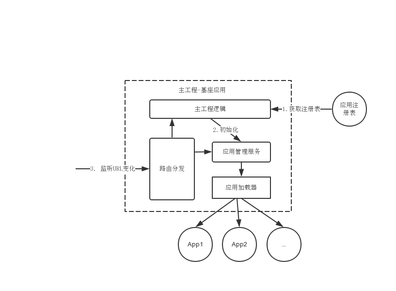

无论是对于从头开发，还是正在迁移的，这种架构的演进都需要一个实施时间。出于以下目的，我们需要快速“发布”MRV版本（最小可发布版本）的微前端架构应用：
* 架构在项目中的可行性验证
* 向领导和团队证明架构的可能性
* 增强团队对于新技术的信心。

在新的项目中，我们可以将带通用性、成本最低的应用，使用微前端架构来编写。我们所做的应该是一个最小的是错成本：
* (1) 有些问题会在第一阶段发生，可以留出空间和计划一一解决
* (2) 如果问题太多可以放弃这个方案

在我们实施的过程中会遇到一个又一个问题，这些问题会让我们考虑如何更好地完善一个微前端架构的应用。我们在团队中会听到各种声音，如“微前端并不是那么好用”，如“我们应该回到原来的方案上”。如果因为技术困难、实施困难而走向原来的架构，多少会有些遗憾；如果只是团队成员不能适应这种变化，那么还是要继续往这个方向前进。有时候我们不得不正视这样的挑战，偶尔在不舒适的区域，可以提升团队的适应能力。

### 一、遗留系统：路由分发
微服务在这个过程中做的事情是，将调用由函数调用变成了远程调用，如远程HTTP调用。

#### 1. 路由分发式前端
路由分发式微前端，即通过路由将不同的业务分发到不同的独立前端应用上。其通常可以通过**HTTP服务器的反向代理**来实现，或者通过**应用框架自带的路由**来解决。

通过路由分发式的微前端架构是采用最多、最易采用的“微前端”方案。这种方式更像是多个前端应用的耦合，我们只是将这些不同的前端应用拼凑到一起，使他们看起来更像是一个完整的整体，但是它们并不是一个整体，每次用户从A应用到B应用的时候，需要刷新一下页面。

下面是一个基于路由分发的Nginx配置示例：
```
http {
    server {
        listen     80;
        server_name www.koala.com;
        location /api/ {
            proxy_pass http://172.31.25.15:8000/api;
        }
        location /web/admin {
            proxy_pass http://172.31.25.16:8000/web/admin;
        }
        location /web/notify {
            proxy_pass http://172.31.25.17:8000/web/notify;
        }
        location / {
            proxy_pass /;
        }
    }
}
```
在这个示例中，不同页面的请求被分发到不同的服务器上。

我们在别的项目上也使用了类似的方式，其主要原因是**跨团队的协作**。

它适用于以下场景：
* 不同技术栈之间差异比较大，难以兼容、迁移、改造
* 项目不想花费大量的时间在这个系统的改造上
* 现有的系统在未来会被取代
* 系统功能已经很完善，基本不会有新需求

在满足上面场景的情况下，如果为了得到更好的用户体验，还可以采用iframe的方式来解决。

#### 2. 路由分发的测试
测试是必不可少的。
路由分发的测试主要分为两种：
* 单元测试。验证生成的跳转URI是否符合我们创建的规则。
* 集成测试。验证生成的URI，以及其最后（重定向）的地址是否符合要求。

### 二、遗留系统微前端：使用iframe作为容器
在采用iframe的时候，我们需要做两件事：
* 设计管理应用机制。加载机制指在什么情况下，我们会加载、卸载这些应用。在这个过程中，采用怎样的动画过渡，让用户看起来更加自然。
* 设计应用通信机制。


**通信机制**

直接在每个应用中创建postMessage事件去监听，对应用的侵入性太强。通过iframeEl.contentWindow去获取iframe元素的Window对象是一个更简化的做法。我们需要定义一套通信规范：事件名采用什么格式、什么时候开始监听事件、什么时候解绑监听事件等。

### 3. 微应用化
微应用化是指，在开发时应用都是以单一、微小应用的形式存在的，而在运行时则通过构建系统合并这些应用，组合成一个新的应用。

使用微应用化意味着我们只能使用唯一的一种前端框架。

一些缺点：
* 所有应用的依赖需要统一。一旦依赖版本不一致，可能会带来其他问题。
* 高度依赖于持续集成。每个子应用在提交的时候，都会重新构建出整个应用。一旦一个子应用出错，系统就会出错。

优点：实现简单、成本较低

#### 1. 微应用化的具体实现
微应用化的形式是，在构建时以单体应用的形式构建；在运行时，以应用模块的形式存在。从原理上说，只是从多个项目中复制出代码，然后合并到一个项目中。

下面是一个Angular应用的目录结构：
 
 ```
 |—— app
    |—— app.routing.moudule.ts
    |—— ...
    |—— reports.module.ts
|—— dashboard
    |—— ...
    |—— dashboard.module.ts
|—— reports
    |—— ...
    |—— reports.module.ts
|—— settings
    |—— ...
    |—— settings.module.ts
 ```
 除了主的app模块，还包含了dashboard/settings/reports三个模块。在微应用化里，上述应用便是最后构建过程中的应用。在构建之前这些模块是以独立App的形式存在的。而主的App模块下的功能，则可以变成主工程。这时，一共会有四个代码仓库：
 * 主代码库。只包含一个空白的框架式代码，它是一个单独的应用，可以独立构建，构建完成则成为包含另外三个应用的完整工程。
 * dashboard应用。在构建时复制对应模块、目录的代码到主工程。
 * settings应用。同上。
 * reports应用。同上。

 这个dashboard应用是一个完整的Angular应用，可以独立地开发运行。下面是dashboard应用的主要结构：
 ```
 |—— app
    |—— app-routing.module.ts
    |—— ...
    |—— dashboard
        |—— dashboard.component.css
        |—— dashboard.component.html
        |—— dashboard.component.spec.ts
        |—— dashboard.component.ts
        |—— dashboard.module.ts
 ```

为了实现以上功能，需要做如下事情：
* (1) 设计一个合理的目录结构，以容纳不同的应用。可以根据路由或者应用名来划分应用。
* (2) 解耦模块间的依赖，使它们独立运行。可以通过懒加载来解耦。

**路由LazyLoading**，即路由懒加载、惰性加载，它是根据不同的路由来将对应的模块、组件切分成不同的代码块。当路由被访问时才加载对应模块、组件。在每个路由对应的模块里，模块本身接近于独立，构建前以独立文件夹的形式，构建后以独立代码的形式存在。

当前的主流框架如Angular/React/Vue是可以支持的。路由LazyLoading依赖的是webpack对于chunk的支持。下面是一个AngularLazyLoading的示例：
```
export const ROUTES: Routes = [
    { path: '', pathMatch: 'full', redirectTo: '' },
    { path: 'dashboard', loadChildren: 'dashboard/dashboard.module#DashboardModule},
    { ... }
]
```
这些模块以相对依赖的方式导入项目，当用户单击/dashboard时，就会寻找dashboard对应的模块。应用在构建的时候会将module独立构建成*.chunk.js。这些chunk文件只在对应的路由被触发时，才会加载进来并渲染相应的模块。

这种懒加载模式意味着：
* 不需要依赖于其他模块就可以构建出应用。
* 可以更新主工程的依赖模块，而不影响系统的整体构建。

#### 2. 架构实施
这种架构模式并不复杂，实施也相对比较简单：
* 持续集成设计。
* 设计占位方式。

**持续集成设计**

其持续集成的触发机制可以由这几部分构成：
* (1) 子应用代码更新，触发对应的模块的持续构建
* (2) 主应用代码更新，触发整个系统的持续构建
* (3) 一旦步骤(1)集成成功，就会触发整个系统的持续构建。

一旦多个项目同时提交代码，就会出现一些问题，整个系统的构建可能会不断地触发。所以不得不考虑将这个应用变成手动构建，或者按时间间隔来构建，如每30分钟构建一次。

此外，为了实现在持续集成服务器上合并子应用及主应用，还需要构建脚本来执行相关的内容。它会执行如下的相关内容：
* (1) 从远程拉取最新的代码
* (2) 使用新的子应用代码代替旧的占位模块
* (3) 执行一些文本替换（可选）

**设计占位方式**

由于应用在编译的过程用依赖于这些模块，所以需要在主工程中引入一些占位模块来代替真实的模块，以避免主工程在编译的过程中出错。

这个占位模式通过以下方式来体现：
* 子应用中指向其它子应用的路由。即是否展示完整的页面，是否展示对应的空白路由页面。
* 主应用中的子应用模块。即以何种方式来展示相关的应用，是否有机制来屏蔽未实现的应用。

#### 3. 测试策略
传统的测试金字塔不能满足需求，需要添加一些额外的测试：
* 应用依赖一致性检测。
* 功能模块生成测试。

这些测试可以在一定程度上判断构建是否成功。

**应用依赖一致性检测**对于前端项目来说，从不同项目中读取配置文件package.json，然后对比其中的版本即可。

**功能模块生成测试**包含以下内容：
* 测试复制的模块能否复制到对应的目录上。
* 测试生成的模块代码大小是否正常。
* E2E测试。

对于模块是否能正确复制进行测试，最简单的方式是编写脚本，在持续集成的过程中运行测试脚本，如果没有检测到exit(-1)，则持续集成构建失败。在拥有了自动化测试之后，我们并不需要这种模式。

### 四、微服务化设计方案
前端微服务化是指，在不同的框架之上设计通信、加载机制，以在一个页面内加载对应的应用。我们所希望的前端微服务化是：
* 应用可以自动加载、运行，并能够与应用注册表进行联系。
* 每个应用的开发时完全隔离的，开发时互不影响。它可以接入某个框架，以更好地支持构建。

应用配置有以下适用性：
* 应用的挂载的DOM节点
* 应用的服务地址
* 应用的唯一标志
* 应用的名称
* 应用所需要加载的脚本文件
* 在加载应用时的事件绑定及应用入口
* 在卸载应用时的事件解绑

对于应用的隔离，则需要深入到不同的框架代码中了解不同框架的生命周期，才能针对性地写出每个框架的加载机制。比如Single-SPA微前端架构方案。

#### 1. 微服务化设计方案
分为两种：
* 通用型微前端方案。即可以适配不同的前端框架，更适合于迁移型的微前端项目。
* 定制型微前端方案。即只适配一种前端框架，适合于从头开发的为前端项目。

方案的选择取决于我们是否进行深度定制？如果只是保证旧系统的代码可以直接运行到新的服务上，通用型方案就能解决问题；如果还需要一系列的定制，那么就要编写适合自己的架构加载方案。而定制也意味着，需要投入额外的成本进行研发。

目前都采用基座化的方式来加载其他应用。基座化方式可以支持加载不同的前端框架，以及在基座工程上绑定业务逻辑。

可以将基座分为两种模式：
* 瘦基式。其只包含框架代码，而核心的业务代码则是由基座加载过来的。
* 胖基式。前端方案相关的代码与业务逻辑代码包含在同一个代码库中。

两种模式从本质上看，区别主要在于业务逻辑是否绑定。

一个设计基座相关功能的流程图：



其整体的工作流程如下所示：
* (1) 主工程在运行的时候，回去服务器获取最新的应用配置
* (2) 主工程在获取配置后，将逐一创建应用，并为应用绑定生命周期
* (3) 当主工程检测到路由变化的时候，将寻找是否有对应的路由匹配到应用
* (4) 当匹配到对应的应用时，则加载相应的应用。

基座包含以下功能：
* 管理其他子应用
* 负责应用间的通信
* 设计路由的相应机制
* 支持嵌入常规及iframe模式

前端应用表是一个静态的JSON文件。

#### 2. 应用间事件
应用名作为前缀，这个前缀可以用来处理应用内的事件，这样会减少与全局的通知事件之间的冲突。

#### 3. 设计路由响应机制
需要设计一个路由的相应机制，即什么时候由什么应用来处理路由？

可以采用以下方案：
* (1) 基座应用只负责自己相应的路由，剩下的路由用一个统一的模块来处理，如Angular中的入口模块AppModule
* (2) 当基座应用的路由发生变化后，会发出对应的路由变化的全局事件
* (3) 在子应用启动后，它们将监听是否有相应的路由变化。

下面是一个路由的关联相应示例：
```
window.addEventListener(MOOA_EVENT.ROUTING_CHANGE, (event: CustomEvent) => {
    if(event.detail.app.name === appName){
        let urlPrefix = 'app'
        if(urlPrefix) {
            urlPrefix = `/${widow.mooa.option.urlPrefix}/`
        }
        router.navigate([event.detail.rul.replace(urlPrefix + appName, '')])
    }
})
```
如果发出事件的应用名称和当前的应用名称一致，那么子应用可以路由到相应的页面。

### 五、通用型前端微服务化：Single-SPA

Single-SPA是一个JavaScript的元框架(meta-Framework)。它可以构建可共存的微前端应用，每个前端应用都可以用自己的框架编写。它能实现以下内容：
* 在同一页面上使用多个框架（React/AngularJS/Angular/Ember等），而不用刷新页面
* 使用新的框架编写前端代码，而无需重写现有的应用程序。
* 延迟加载前端应用和代码，用于改善初始加载时间

Single-SPA是一种瘦基座的架构模式，这种基座只负责按照生命周期规范来处理应用，并不负责应用的生命周期的实现。子应用具体的生命周期是由自身来完成的，基座只负责按照自己定义的规范来执行。

#### 1. 基座部分
Single-SPA的基座部分（在其框架定义里是指根应用程序）只负责定义应用相关的生命周期，以及应用基本的配置。下面是一个Single-SPA的根应用程序的代码示例：
```
import * as singleSpa from 'single-spa';

singleSpa.registerApplication('app-1', ()=> import('app1/app1.js')),pathPrefix('/app1'));
singleSpa.registerApplication('app-2', ()=> import('app1/app1.js')),pathPrefix('/app2'));
singleSpa.start();
```
如上代码所示，基座并不需要关心子应用的技术栈，由子应用来完成相应的生命周期实现。但是，在某些复杂的前端框架，如ember，需要加载额外的库才能实现加载功能。在这个示例里app-1是一个React框架编写的应用，而app-2则是一个Angular框架编写的应用。
 #### 2. 子应用部分
 子应用需要做如下事情：
 * 根据不同的框架设计生命周期
 * 根据不同的应用创建加载的DOM节点

 下面是一个基于Single-SPA及Single-SPA-React的React子应用的应用配置代码：
 ```
 import React from 'react';
 import ReactDOM from 'react-dom';
 import singleSpaReact from 'single-spa-react';
 import Root from './root.components.js';
 const reactLifecycles = singleSpaReact({
     React,
     ReactDOM,
     rootComponent: Root,
     domElementGetter
 });
 export function bootstrap(props) {
     return reactLifecycles.bootstrap(props);
 }

 export function mount(props) {
     return reactLifecycles.mount(props);
 }
 
 export function unmount(props) {
     return reactLifecycles.unmount(props);
 }
 ```

 配置的核心部分是创建reactLifecycles定义的部分。在初始化这个变量时，需要传入应用程序相关的信息及根组件(rootComponent)，通过这些信息创建一个React应用。

 对于Angular等框架也是类似的，只是不同框架的传入参数不同。下面是一个Single-SPA的Angular应用的配置示例：
 ```
 const ngLifecycles = singleSpaAngular({
     domElementGetter,
     mainModule,
     angularPlatform: platformBrowserDynamic(),
     template: `<app2/>`,
     Router,
 })
 ```
 由于不同的前端应用会定义自己的DOM节点，以挂载应用到节点上。因此在完成相关的配置后，还需要创建对应的DOM节点，或者直接传入相应的元素。如上述的React或者Angular配置，都依赖于domElementGetter元素。当页面上还不存在对应的元素时，需要手动地在这个配置文件中创建。
 ```
 function domElementGetter() {
     let el = document.getElementById('app1');
     if(!el) {
         el = document.createElement('div');
         el.id = 'app1';
         document.body.appendChild(el);
     }
     return el;
 }
 ```

 当我们拥有DOM节点、定义完子应用的生命周期，以及基座应用根据路由匹配到对应的应用时，就可以加载对应的应用。

 #### 3. 优缺点
 优势：
 * 能支持大部分主流的前端框架，也能支持传统的前端框架。
 * 提供更好的用户体验。即不需要页面跳转，直接在当前页面载入。
 * 方便与迁移旧的遗留系统。

 缺陷：
 * 系统构建复杂。应用需要集成在一起进行构建。
 * 不支持不同应用的部署分离
 * 代码结构复杂。
 * 有额外的大量学习成本。

 对于系统构建和分离部署来说，结合之前微应用化的组合式集成方案，也是一个不错的选择——先创建占位模块，然后在构建时进行替换。因此，在Single-SPA的各种兼容方案的基础上，创建自己的微前端方案是一种更好的选择。

 ### 六、定制型前端微服务化：Mooa
对于复杂的应用来说，其架构往往是基于多个架构演进而成的。因此，基于某个“成熟”的方案来修改出适合自己的方案，才是最好的方法。Mooa框架是基于Single-SPA来实现的。

Mooa框架的基本架构模式：
* 主工程，负责加载其他应用，以及用户权限管理等核心控制功能。
* 子应用，负责不同模块的具体业务代码。

在这种模式下，由主工程来控制整个系统的行为，子应用则做出一些对应的相应。

#### 1. 主工程部分
主工程做以下事情：
* (1) 初始化微前端框架相关的配置
* (2) 从远程获取所有子应用的配置
* (3) 配置所有的子应用
* (4) 进行主工程和子应用的路由配置
* (5) 检测路由变化，一旦匹配到对应的路由，则加载对应的应用，并卸载旧的应用

下面是Mooa框架的初始化(app.component.ts)：
```
this.mooa = new Mooa({
    debug: false, // 不开启微前端框架的调试功能
    parentElement: 'app-home', // 子应用的父级节点元素
    urlPrefix: 'app', // 应用的URL前缀
    switchMode: 'coexist', // app间的切换模式
    preload: true
})
```
对于定制型的方案其具体配置都是不同的，但是基本思想都是类似的。

下面是Mooa框架的子应用配置示例：
```
[{
    "name": "app1",
    "selector": "app-app1",
    "baseScriptUrl": "/assets/appa",
    "styles": ["styles.abdcs12a9.css"],
    "prefix": "app/app1",
    "scripts": [
        "main.xxx.js",
        "polyfills.xxx.js",
        "runtime.xxx.js"
    ]
}]
```
上面的大部分配置都是指向与App相关的静态文件的，用于在加载应用时使用。在有了上述配置和应用数据后，我们就可以在app.component.ts中创建应用，并绑定相应的路由时间。当路由发生变化时，可以通过框架来通知其他应用：
```
private createApps(data: IAppOption[]) {
    data.map((config) => {
        this.SVGPathSegMovetoAbs.registerApplication(config.name, config, mooaRouter.matchRoute(config.prefix));
    });
    this.router.events.subscribe((event) => {
        if(event instanceof NavigationEnd) {
            this.mooa.reRouter(event);
        }
    });
    return this.mooa.start();
}
```

#### 2. 子应用部分
在设计时需要考虑以下内容：
* 降低前端架构相关代码的侵入性
* 设计一套机制来应对微前端和独立运行的两种模式。可以注入一个全局变量。

相对于Single-SPA，一共需要三种对应的修改逻辑。

**路由更新**

在App开始运行的时候，需要检测是否在子应用中跳转到对应的路由。

监听路由代码的逻辑如下：
```
export class AppComponent {
    constructor(private router: Router) {
        mooaPlatform.handleRouterUpdate(this.router, 'app1');
    }
}
```

**适配Angular框架的基准URL**

对于Angular框架而言，它还需要配置基准的URL（形如&lt;base href="/"&gt;),对于子应用来说，它需要位于对应的app路径下。因此，需要在对应的app.modules.ts中进行APP_BASE_HREF的配置：
```
providers: [
    {provide: APP_BASE_HREF, useValue: mooaPlatform.appBase() }
]
```

**解决依赖冲突**

在Angular中使用Zone作为变化检测机制，因此每个应用都会在polyfill.ts中引入Zone。如果一个页面中存在多个Zone就会发生冲突，对于这个冲突，我们需要手动解决，比如只在基座应用中引入Zone.js文件（子应用中不引入Zone.js)。

#### 3. iframe隔离
在设计过程中，可以考虑引入iframe来隔离应用。

要想控制不同的iframs，需要做到以下几点：
* (1) 为不同的子应用分配ID
* (2) 在子应用中进行hook，以通知主应用：子应用已加载。
* (3) 在子应用中创建对应的事件监听，来相应主应用的URL变化事件。
* (4) 在主应用中监听子程序的路由跳转等需求。

### 七、组件化微前端：微件化
微件化是指，每个业务团队编写自己的业务代码，并将编译好的代码部署到指定的服务器上。在运行时，我们只需要加载相应的业务模块即可。

广义的微件化方式可以分为三种：
* DSL微件化，即通过创建领域特定语言(DSL)来实施微件化
* 预编译微件化
* 运行时编译微件化

对于DSL微件化而言，它不是一种真正的微件化方案，也不可能使用DSL来编写复杂的业务组件。

微件化的应用模式：
* 完成本地微件请求时，从微件注册中心查找微件。
* 应用在获得对应的微件请求时，从微件注册中心查找微件。
* 一旦匹配到对应的微件，就下载相应的微件代码
* 将微件嵌入页面中执行

如果存在第三方开发组件，就需要寻找如iframs这样的隔离方案。微件化并不适合复杂的前端应用。

对于传统的多页面应用来说，微件化是相当容易实施的方案。在传统的多页面应用结构中，只需要编写相应的HTML/CSS/JS，就可以在加载微件时创建相应的组件和元素，再替换到相应的DOM节点上。类似于WebComponents。

主流前端框架(React/Vue/Angular)都支持微件化的方案。Vue使用传统的ES5+HTML模板语法，可以直接嵌入页面使用，而Angular使用TS，React使用JSX语法，需要编译后才能嵌入页面中运行。

#### 1. 运行时编译微件化：动态组件渲染
运行时编译微件化，即组件再运行时才编译和运行微件化。需要引入整个框架的编译器，才能创建相应的组件，并加载页面中。运行时编译微件化也对应用的体积和性能造成了一定的影响。

**Vue微件化**

Vue可以直接嵌入现有的页面中：
```
<div id="app-2">
    <span v-bind:title="message">
    </span>
</div>
```
相关的JavaScript代码如下：
```
var app2 = new Vue({
    el: '#app-2',
    data: {
        message: "Hello, Kitty!"
    }
})
```
只需将上述两部分代码放置在远程。当需要时创建ID为app-2的元素，再运行相应的JavaScript脚本即可。

**Angular微件化**

具体内容如下：
* 在核心工程中提供微件化所需要的环境，即应用相关的依赖，如Angular相关的依赖
* 在微件工程里，构建出能运行在核心工程的代码。

在Angular微件化的工程中，依赖System.js来完成依赖环境的构建和微件构建。

System.js是一个通用的动态模块加载器，它为浏览器和Node.js提供加载ES6模块、AMD、CommonJS和全局脚本的能力。

下面是一个使用Angular+System.js构建出来的组件代码示例：
```
System.register(['@angular/core', '@angular/conmmon/http', '@angular/common'],function(exports, module){
    ...
})
```
它与AMD形式类似，只要在模块中引入这些依赖，组件就能拥有对应的依赖来运行。

核心工程中使用System.js提供依赖，具体代码如下：
```
SystemJS.set('@angular/core', SystemJS.newModule(angularCore));
SystemJS.set('@angular/common', SystemJS.newModule(angularCommon));
SystemJS.set('@angular/common/http', SystemJS.newModule(angularCommonHttp));
```

配合Angular的动态组件加载机制，就可以加载对应的微件并运行，具体代码如下：
```
// 导入微件
const module = await SystemJS.import(widget.moduleBundlePath);
// 编译模块
const moduleFactory = await this.compiler.compileModuleAsync(module[widget.moduleName]);
// 解析ComponentFactory
const moduleRef = moduleFactory.create(this.injector);
const componentProvider = moduleRef.injector.get(widget.name);
const componentFactory = moduleRef.componentFactoryResolver.resolveComponentFactory(componentProvider);
// 编译组件
this.msContentScript.createComponent(componentFactory);
```
对于微件而言，需要单独配置编译、构建脚本。

#### 2. 预编译微件化
既然在运行时编译可能产生性能问题，那么就尝试提前编译这些微件。

**React微件化**

使用React框架的微件化开发，需要先将其编译为可在浏览器上运行的ES5代码，再放到浏览器上运行。

相关实施步骤如下：
* (1) 编写统一的API，封装React的根组件
* (2) 修改构建系统的配置，让其输出可在浏览器上直接运行的版本。
* (3) 加载对应的JavaScript脚本，并调用组件的初始化方法。

下面是封装接口的示例代码：
```
export const init = (config) => {
    ReactDOM.render(<App/>, document.getElementById('root'));
    ServiceWorker.unregister();
}
```
通过修改webpack.*.js配置文件，将构建的目标平台配置为umd，同时修改库为MyApp，相关代码如下：
```
var config = {
    output: {
        ...,
        library: 'MyApp',
        libraryTarget: 'umd',
        umdNameDefine: true
    }
}
```
接下来，需要在页面中引入对应的组件，并执行相应的初始化代码即可，相关代码如下：
```
<script src="./bundle.js" type="text/javascript"></script>
<script type="text/javascript">
    MyApp.init({
        some: "config"
    })
</script>
```
基于这个基本的原则，我们就可以构建出基于React框架的微件化方案。

**通过构建工具进行微件化**

有一些项目通过webpack的hack实现了微件化，实现过程很麻烦。

在微件化的实现的过程中，需要深入了解webpack的编译过程，以及框架的相应原理。

其基本思想和运行时的微件化是类似的，即为微件提供一个可运行的环境。作为预编译的微件，其流程中比较麻烦的地方是，提供一个Mock的包依赖环境，让两个不同项目中编译出来的组件(chunk)交叉运行。

### 八、面向未来：Web Components

Web Components是一套技术，允许开发人员创建可重用的定制元素，可以在Web应用中使用它们。

Web Components主要由如下四项技术组件组成：
* Custom Elements(自定义元素)，允许开发者创建自定义元素。
* Shadow DOM(影子DOM)，它是一组JavaScript API，用于将封装的“影子”DOM树附加到元素中，并控制其关联的功能。通过它可以保持元素的私有化，而不用担心与文档的其他部分发生冲突。
* HTML Templates(HTML 模板)，如&lt;template&gt;和&lt;slot&gt;元素，可以用于编写不在页面中显示的标记模板。
* HTML Imports，用于引入自定义组件。目前的做法都是讲组件的定义细节存储在一个单独的文件中，再通过导入文件来使用。

Web Components的组件由link标签引入，具体代码如下：
```
<link rel="import" href="components/di-li.html">
<link rel="import" href="components/di-header.html">
```
在页面中使用这些组件的代码如下：
```
<d-header></d-header>
<div class="container">
    <di-li (click)="world()" [draggable]="true"></di-li>
</div>
```
这种方式与之前使用iframe的方式相似，组件拥有自己独立的脚本和模式，以及对应的用于单独部署组件的域名。

在需要使用组件时，可以做如下事情：
* 创建组件的DOM节点
* 通过HTML Imports导入组件


